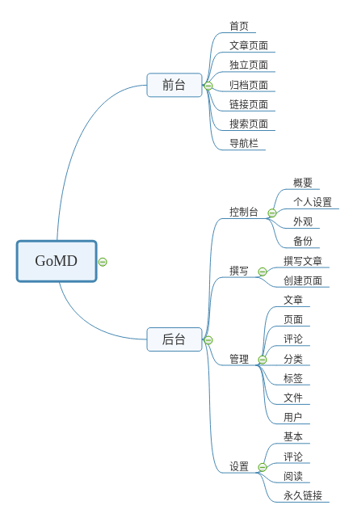

# 模块划分

## 参考

- nicefish-core: 提供通用的工具
- nicefish-auth-shiro: 提供基于Shiro的通用认证和鉴权服务
- nicefish-staff-org: 提供经典的树形组织机构和员工管理
- nicefish-cms: 基于以上基础模块的内容管理应用

| 模块        | 释义                                           | 备注                                             |
| ----------- | ---------------------------------------------- | ------------------------------------------------ |
| blog-core   | 核心业务类模块，提供基本的数据操作、工具处理等 | 该模块只是作为核心依赖包存在                     |
| blog-admin  | 后台管理模块                                   | 该模块作为单独项目打包部署                       |
| blog-web    | 前台模块                                       | 该模块作为单独项目打包部署                       |
| blog-spider | 爬虫相关代码模块                               | 目前仅作为后台管理模块里“文章搬运工”的实现代码库 |

## 使用

- blogxzhi-core
- blogxzhi-admin
- blogxzhi-web
- blogxzhi-common
- 

# 蓝图

## 参考

# 技术栈

## 参考

- 核心框架：SpringBoot
- ORM 框架：MyBatis
- MyBatis 工具：MyBatis Mapper
- MVC 框架：Spring MVC
- 模板引擎：Freemarker
- 编译辅助插件：Lombok
- CSS 框架：BootStrap 4.0
- Markdown 编辑器：Editor.md
- 数据库：MySQL

- 核心框架：`SpringBoot2.0`
- 安全框架：`Apache Shiro 1.3.2`
- 缓存框架：`Redis 4.0`
- 任务调度：`quartz 2.3`
- 持久层框架：`MyBatis 3`
- 数据库连接池：`Alibaba Druid 1.0.2`
- 日志管理：`SLF4J 1.7、Log4j`
- 前端样式：`Tale`
- 上传框架：`DropZoneJs`

https://gitee.com/song_haozhi/mayday

1. [SpringBoot](http://spring.io/projects/spring-boot) 版本2.0.4
2. [MyBatis](http://www.mybatis.org/mybatis-3/) ORM框架
3. [MySQL](https://www.mysql.com/) 数据库，版本5.6
4. [Maven](http://maven.apache.org/) 依赖管理
5. [Druid](https://github.com/alibaba/druid/) 阿里连接池
6. [Thymeleaf](https://www.thymeleaf.org/) spring官方推荐的模板引擎
7. [Vali Admin](https://github.com/pratikborsadiya/vali-admin) 后台模板
8. [jquery toast插件](http://www.jqueryfuns.com/resource/2412) 信息提示插件
9. [Font Awesome](http://www.fontawesome.com.cn/faicons/) 图标库
10. [Thumbnailator](https://github.com/coobird/thumbnailator) 压缩图片工具类
11. [Hutool](http://hutool.mydoc.io/) Hutool是一个Java工具包
12. [PageHelper](https://pagehelper.github.io/) mybatis分页插件
13. [Bootstrap-Fileinput](https://github.com/kartik-v/bootstrap-fileinput) bootstrap上传控件
14. [halo](https://github.com/ruibaby/halo) halo博客系统
15. [Ehcache](http://www.ehcache.org/) Java的进程内缓存框架
16. [MDTool](https://github.com/cevin15/MDTool) 将markdown转换为html的工具

https://gitee.com/yadong.zhang/DBlog

- Springboot 2.0.8
- Apache Shiro 1.2.2
- Logback
- Redis
- Lombok
- Websocket
- MySQL、Mybatis、Mapper、Pagehelper
- Freemarker
- Bootstrap 3.3.0
- wangEditor
- jQuery 1.11.1、jQuery Lazyload 1.9.7、fancybox、iCheck
- 阿里云OSS
- kaptcha
- Qiniu
- webMagic

# 灵感

- 目录导航
- 编辑器
  - markdown
  - 富文本
- 